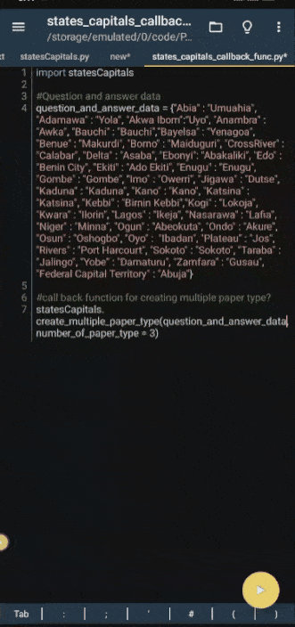

### 📄 Exam Question Shuffler & Marker

**What it does:**  
Generates multiple shuffled versions of a question paper, along with unique answer keys.

**Why I built it:**  
To help educators save time preparing randomized exams and accurate marking guides.

**How it works:**  
Reads in question data, shuffles it, and outputs multiple Word/PDF versions with corresponding marking guides.

**Technologies Used:**  
Python, random module, docx

**Features:**
- Unlimited shuffling
- Auto-generated marking keys
- Simple input format

**Screenshots & GIFs**  
  

---
